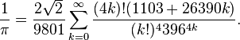

03: File Processing
================================================================================

Refresher from last time
--------------------------------------------------------------------------------

- We can control flow within the program with `if/elif/else` blocks

- Lists are a good way to store basic data


`for/while` Loops
--------------------------------------------------------------------------------

- While loops work similarly to if statements, but will continue performing
  actions until some condition is met
  - You need to make sure that you update whatever variable is needed for the
    condition within the loop, otherwise the loop will never finish
  - We've seen a `while` loop used already: `bisection.py`

- Think of for being for each, so for each item in a container
  ```python
  for item in user_list:
      print('user: {}'.format(item))
  ```
- Looping is commonly done over items within a list/string, or just an index
  number (using `range([start,] stop[, step]`)

- A nice additional thing, if you want the index *and* the item, is to use
  `enumerate`: `for i, value in enumerate(user_list)`


Example: Srinivasa Ramanujan
--------------------------------------------------------------------------------

- Way to estimate π:

  

- What else do we need to program in order to figure this out?


File processing
--------------------------------------------------------------------------------

- Most scientific work involves reading from and writing to files to store or
  access data
  - Python is great with this, since it works very well with strings and files
    without much "boilerplate" code
  - By default, information will be returned as a string

- Use basic UNIX path conventions to access files (`.` is current directory,
  `..` is the directory above, `/` to separate directories)

- Basic structure (reading):
  ```python
  f = open(filename, 'r')
  f.read()  # f.readline() for just one line
  f.close()
  ```
  - `read/readline` returns an empty string if they have reached the end of the
    file, so you can use this as a "sentinel" value
  - An empty line still contains a newline (`\n`) character

- Basic structure (writing):
  ```python
  f = open(filename, 'w')
  f.write('string to write\n')
  f.close()
  ```


Saving data from files
--------------------------------------------------------------------------------

- Loop over the data or read until you have everything you need (`for` loops are
  great to use here!)

- In general, need to create an empty list, then append to it to save the data
  ```python
  data = []
  for line in f:
      # process line if necessary
      data.append(line)
  ```

- Now, let's do stuff with the data! Count up how many times each word appears
  in `northwind.txt`, and find the average number of sunspots in `sunspots.txt`


Necessary string work
--------------------------------------------------------------------------------

- Usually you'll end up doing the same thing to each line, so very easy to put
  inside of the `for` loop for processing

- Essentials are: `s.strip()` (removes leading and trailing whitespace,
  including newlines), `s.split()` (breaks the string up into a list on any
  whitespace by default or only what you pass in), and converting values into
  numbers (`int(s)` or `float(s)`, usually)


Example files
--------------------------------------------------------------------------------

- `nothwind.txt` separate by word to get used to file I/O

- `sunspots.txt` separate out into bin and counts as individual lists
